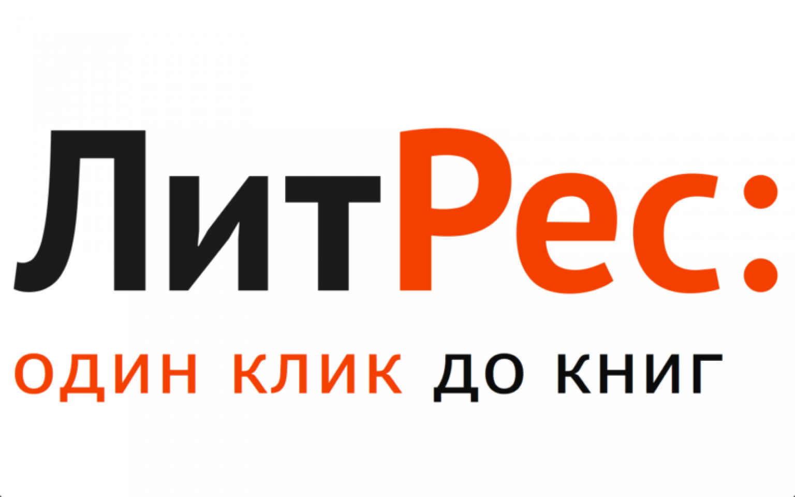

# Дипломный проект по UI автоматизации тестирования веб-сайта [LitRes](https://www.litres.ru/)

  

## Содержание:
- [Реализованные проверки по тест-кейсам](https://github.com/Elena0808/diplom_ui#%D1%80%D0%B5%D0%B0%D0%BB%D0%B8%D0%B7%D0%BE%D0%B2%D0%B0%D0%BD%D0%BD%D1%8B%D0%B5-%D0%BF%D1%80%D0%BE%D0%B2%D0%B5%D1%80%D0%BA%D0%B8-%D0%BF%D0%BE-%D1%82%D0%B5%D1%81%D1%82-%D0%BA%D0%B5%D0%B9%D1%81%D0%B0%D0%BC)
- [Используемый стек]()
- [Сборка в Jenkins]()
- [Allure report]()
- [Пример прохождения тестов]()

## Реализованные проверки по тест-кейсам
✓ Проверка авторизации при вводе валидных данных  
✓ Проверка появления окна регистрации при вводе email под которым еще не зарегистрировались на сайте  
✓ Проверка авторизации с невалидным паролем  
✓ Проверка поиска отсутствующей книги  
✓ Поиск существующей книги  
✓ Поиск книг с параметрами  
✓ Добавление книги в корзину ( отрабатывает локально, на selenide падает с ошибкой сессии)  
✓ Создание нового списка книг  
✓ Открытие фрагмента книги   

## Используемый стек

<code></code>
<code></code>
<code></code>
<code></code>
<code></code>
<code></code>
<code></code>

